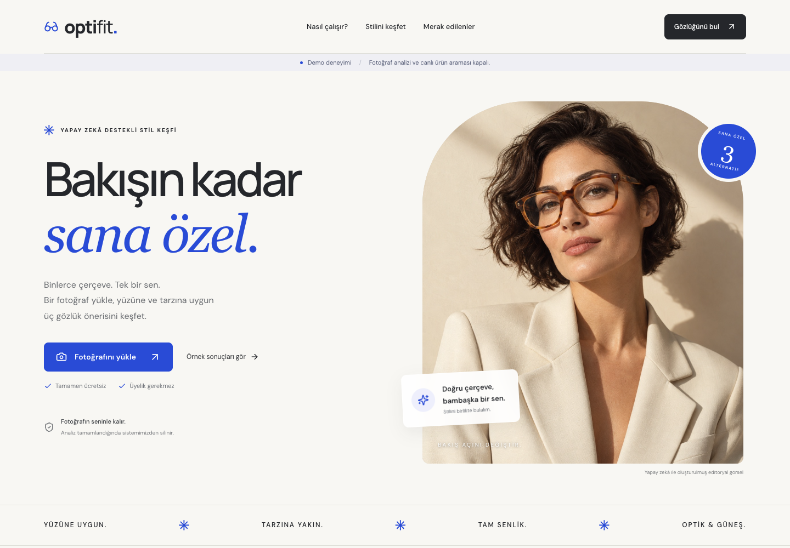
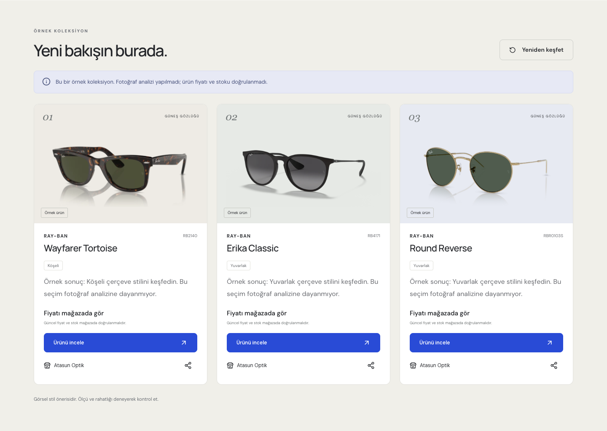
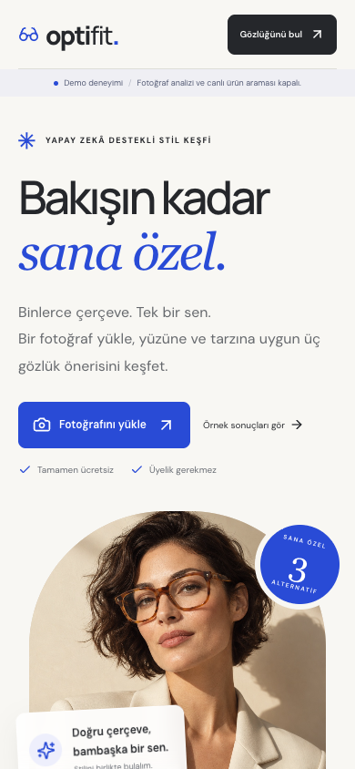

<div align="center">

# OptiFit

### Find frames that feel like you.

Photo-based eyewear discovery for the Turkish market, with an account-free experience, AI-assisted style analysis, and recommendations grounded in merchant product pages.

**Vue 3 · TypeScript · Spring Boot · Spring AI · Gemini · Tavily**

[Quick start](#quick-start) · [Screenshots](#screenshots) · [How it works](#how-it-works) · [Development](#development)

</div>



## What is OptiFit?

OptiFit helps people explore sunglasses and optical frames from a photo and a few preferences. Its Turkish-language interface combines a simple upload flow with product cards, store links, and sharing—without requiring an account.

Live mode uses Google Gemini to assess visible facial features and suggest frame styles and model candidates. Tavily discovers matching merchant pages; the backend checks product evidence before returning up to three distinct models. Prices and purchase links come from verified pages, rather than model-generated claims.

The repository runs in **demo mode by default**, with no API keys or paid provider calls. Demo recommendations are explicitly labelled examples, not personalized analysis.

## Highlights

- **No signup:** anonymous, session-scoped uploads and results.
- **Personal preferences:** eyewear category, budget, style, and color.
- **Grounded recommendations:** category, stock, model identity, and budget checks against merchant pages.
- **Honest empty states:** partial results or no match when evidence is insufficient.
- **Temporary data:** photos processed in memory; results expire after one hour and can be deleted earlier.
- **Responsive experience:** desktop and mobile layouts, accessible dialogs, drag-and-drop uploads, and shareable store links.
- **Built-in safeguards:** CSRF protection, upload validation, bounded workers, request quotas, and merchant allowlisting.

## Screenshots

These screenshots show the application running locally in demo mode. The interface is Turkish; project documentation and source code are English.

### Photo and preferences


### Example recommendations



<details>
<summary>Mobile view</summary>
<br>

</details>

## Quick start

**Requirements:** JDK 21+, Maven 3.9+, Node.js 22+, and npm.

```sh
git clone https://github.com/alpercandemir/optifit.git
cd optifit
cp .env.example .env
./scripts/dev.sh
```

Open [localhost:5173](http://127.0.0.1:5173). The script builds the backend, installs frontend dependencies, and starts both services. Ports `8080` and `5173` must be available.

Choose **“Örnek sonuçları gör”** to explore recommendations without uploading a photo. Demo mode includes sample sunglasses; optical frames and unverifiable budget filters can return no match. Sample prices and stock are intentionally omitted. Demo cards use product image URLs from their linked merchant pages; unavailable images fall back to a labelled placeholder.

### Live mode

Edit your local `.env`:

```dotenv
OPTIFIT_MODE=live
GEMINI_API_KEY=your-gemini-api-key
GEMINI_MODEL=gemini-3.5-flash-lite
TAVILY_API_KEY=your-tavily-api-key
```

Restart `./scripts/dev.sh`. Both keys are required: live mode fails startup if either is missing. Choose a Gemini model available to your account with image and structured-output support. Provider usage may incur charges.

Credentials are read on the server from environment variables. `.env` is ignored by Git; `.env.example` contains only empty credential fields. Never place provider keys in frontend code or commit them to source control.

In live mode, the normalized photo is sent to Google Gemini, whose data-handling terms apply. Tavily receives product search terms, not the photo or session identifier.

### Docker

```sh
cp .env.example .env
docker compose up --build
```

Open [localhost:8088](http://127.0.0.1:8088). Nginx serves the frontend and proxies API calls to the backend. The default database is in-memory H2; PostgreSQL is optional. Container deployment still needs an environment-specific smoke test.

## How it works


1. **Prepare the photo.** Validate format and size, apply EXIF orientation, remove metadata, and resize to a bounded JPEG.
2. **Analyze style.** In live mode, Gemini evaluates image quality and proposes frame attributes and specific model candidates.
3. **Discover products.** Search permitted Turkish merchant domains using product terms and candidate model codes. If model search yields no eligible products, make one broader category/shape search under the same 24-second search budget (at most two basic Tavily credits).
4. **Verify evidence.** Inspect product detail pages for structured product data, identity, category, price, stock, and consistent HTTPS URLs.
5. **Rank and present.** Enforce category and budget, deduplicate model variants, and return complete, partial, or empty results.

Merchant pages with insufficient evidence or blocked access are omitted. The current research sources are Atasun Optik, İstanbul Optik, and Alkım Optik; they are not claimed commercial partners. Product images are displayed when accepted image URLs exist in verified product metadata, with placeholders otherwise.

## Architecture

| Layer | Implementation |
| --- | --- |
| Frontend | Vue 3, TypeScript, Vite, self-hosted fonts, Lucide icons |
| API | Java 21, Spring Boot 4.1.1, Spring Security |
| AI | Spring AI 2.0.1, Google Gemini |
| Product discovery | Tavily Search, Jsoup, schema.org JSON-LD verification |
| Storage | In-memory H2 by default; optional PostgreSQL |
| Testing | JUnit/Spring tests, Vitest, Playwright |
| Deployment | Docker Compose, Nginx |

Photos stay in application memory during processing and are cleared after analysis, cancellation, or timeout. Results belong to the anonymous browser session and expire after one hour. Restarting the default H2 deployment discards stored results. Only product/store URLs are shared.

Workers, sessions, and quotas are process-local. This is a single-node application; shared storage alone does not make it ready for horizontal scaling.

## Development

Run the standard checks:

```sh
./scripts/check.sh
```

Or run each layer independently:

```sh
mvn -f backend/pom.xml -Djava.awt.headless=true verify
npm --prefix frontend ci
npm --prefix frontend run format:check
npm --prefix frontend test
npm --prefix frontend run build
```

Run browser tests after building the backend:

```sh
cd frontend
npx playwright install chromium
npm run test:e2e
```

Browser tests cover the anonymous upload flow, result persistence and deletion, empty states, product images, and responsive layouts. Backend tests exercise upload validation, session ownership, CSRF, cancellation, expiry, quotas, product verification, and filtering. Live-provider diagnostics are opt-in and excluded from ordinary test runs.

Format Java changes with `mvn -f backend/pom.xml spotless:apply` and frontend changes with `npm --prefix frontend run format`. CI runs the repository checks on pushes and pull requests.

## Project layout

```text
backend/       Spring Boot API, provider integrations, and tests
frontend/      Vue application and browser tests
docs/          Operations, asset provenance, and screenshots
scripts/       Local development and verification commands
specs/         Product requirements
compose.yml    Local container setup
.env.example   Configuration template without credentials
```

## Deployment notes

Live model quality, merchant coverage, source permissions, and full photo-to-recommendation behavior need production validation. Merchant markup and availability may change; optical-frame coverage is not guaranteed. Recommendations are visual style suggestions, not prescription advice or a guarantee of physical fit.

Before exposing the service publicly, configure HTTPS and secure cookies, provider spending limits, trusted proxy handling, data-retention policies, and permitted merchant/image usage. See [Operations](docs/OPERATIONS.md) for configuration and limitations, [Asset provenance](docs/ASSETS.md) for visual credits, and [Product requirements](specs/PRD.md) for scope.
